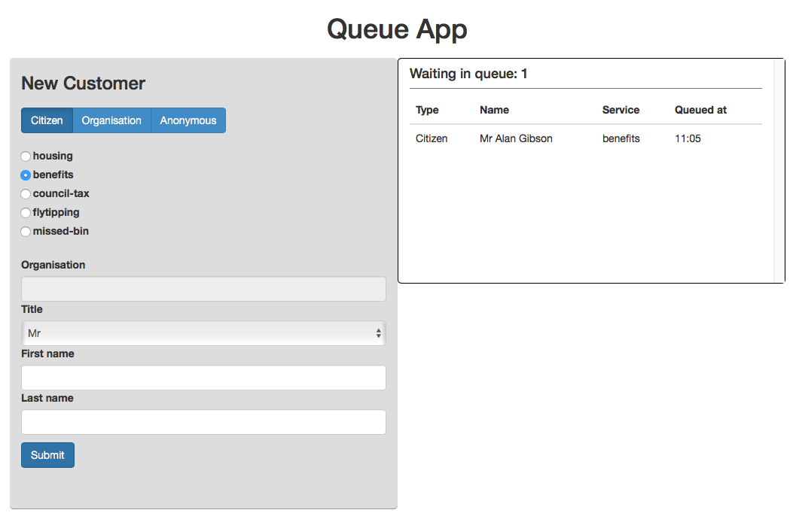

<h2>Code Test</h2>

<h3>Framework and Language</h3>

To complete this coding test I used Ruby as I felt I could complete the majority of the criteria given that this is the language I would consider myself most proficient in. I then chose to use Ruby on Rails as this demonstrates my knowledge of the MVC model.

In development it uses SQLite3 but in production it uses PostgreSQL for it's database. The SQLite3 database is perfect for development as it's easy to use, but PostgreSQL is a step up, might be a bit overkill for a simple queuing application but I went ahead and set it up anyway.

<h3>CSS Framework</h3>

I used the Bootstrap framework to create a simple layout, mainly because their grid system is so easy to use and it looks nice. For example instead of a simple set of radio buttons for selecting Citizen, Organisation, or Anonymous I styled them like buttons which can be pressed

<h3>Javascript/jQuery</h3>

Because it's just a simple web app I used AJAX to update the database with new customers to save from redirecting the browser each time, however the Customers controller is able to handle a normal HTTP request to create a customer too.

The form has certain parts greyed out depending on which type of customer it is. If the form is filled out and a new customer type is selected then the form will clear itself.

<h3>Validations</h3>

I was going to add validations to check inputs depending on what customer type was selected as I know if a user has javascript disabled it would affect how the app functions, but I felt I had taken long enough with the test and didn't want to go over my time

If I was to implement validations I would use client side input verification (Javascript), and then server side (on the Customer model itself) to be doubly sure submitted information was correct before saving to the database.

<h3>Running the app</h3>
<ol>
  <li>Download from GitHub</li>
  <li>'cd' into directory</li>
  <li>run 'bundle install'</li>
  <li>after all gems have installed run 'rails s' to fire up the server</li>
  <li>go to <a href="http://localhost:3000">localhost:3000</a> in your browser</li>
  <li>Start adding customers to your hearts content!</li> 
</ol>

To make it extra simple to view how the app works I pushed it to Heroku which can be viewed <a href="https://alan-gibson-test.herokuapp.com">here</a>.

